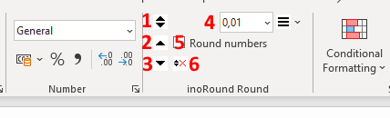

# Excel Add-In which adds a graphical user interface to use the rounding functions

Add the inoRound.xlam file to the Excel Add-Ins.

Currently the user interface is available in English and German. The language is chosen by the add-in according to the language of the Excel GUI.

## Installation

Download the file inoRound.xlam to your system.

In Excel use File - Options

Choose tab Add-ins and select "Manage Excel-Add-Ins" and click go.

Use "Browse" to select inoRound.xlam and make sure Inoround is ticked.

Now the Add-In is available.

## Usage

The Add-In is available on the Home Tab between Number and Styles

To round figures in calculations select the cells and use:

1 to round flexible

2 to round up

3 to round down

The number of digits to round to is defined at 4.

If 5 "Round numbers"  is ticked given figures are rounded as well.